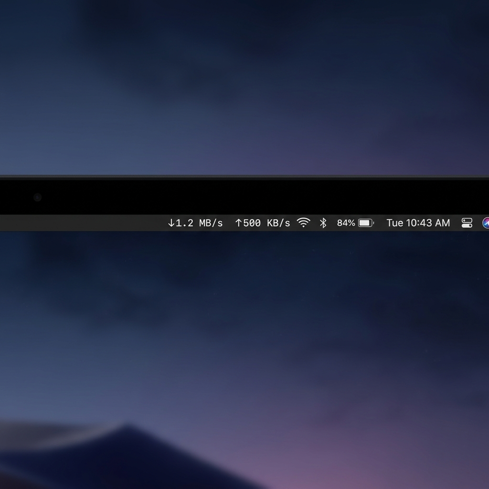
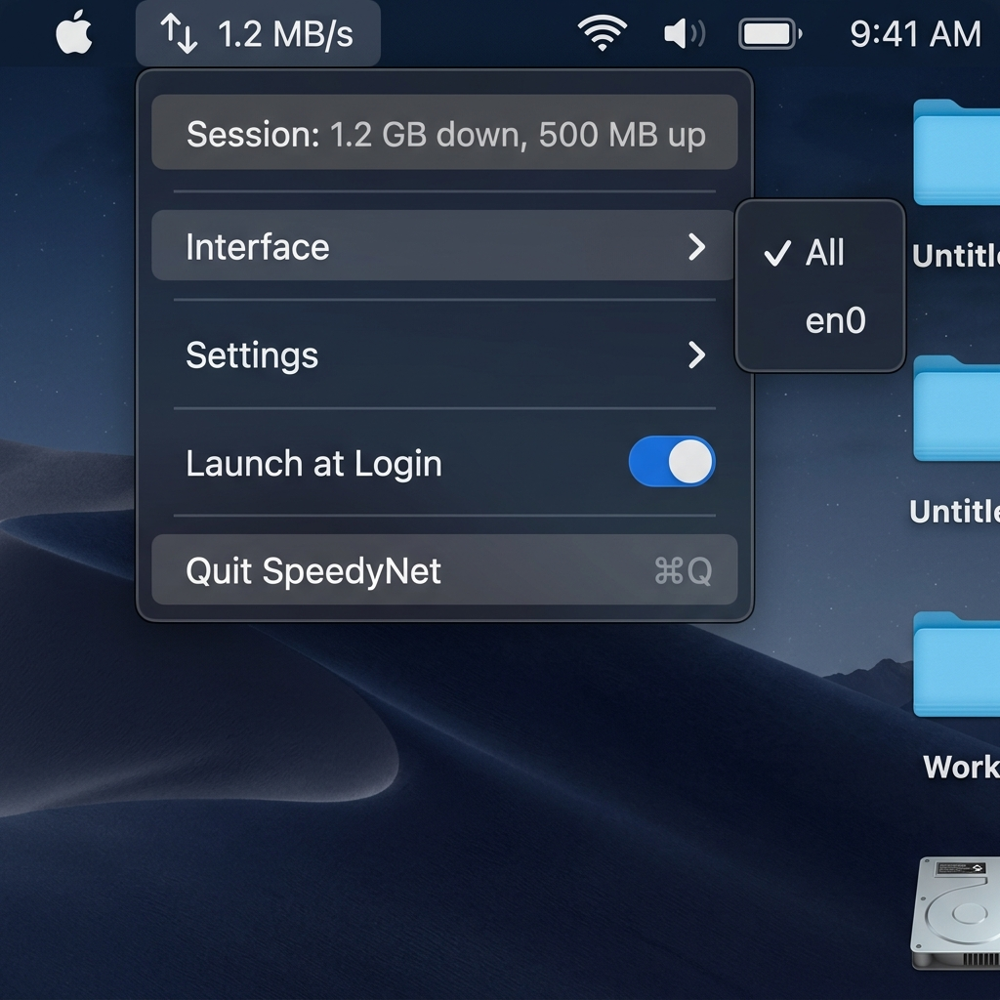

# macOS Network Monitor

A sleek, native macOS menu bar accessory that displays real-time network upload and download speeds, built entirely with Swift and standard macOS libraries (no third-party dependencies).



## Features

- **Real-time Speeds**: View download (↓) and upload (↑) speeds calculated dynamically from macOS `sysctl` kernel APIs.
- **SF Symbols**: Uses native Apple symbols for a clean and beautiful look in both light and dark mode.
- **Dynamic Colors**: Numbers change color (Green/Orange) when data thresholds are exceeded.
- **Interface Selection**: Choose to monitor all traffic, or isolate specific interfaces like Wi-Fi (`en0`) or loopback (`lo0`).
- **Session Totals**: See how much data has been downloaded and uploaded since the monitor was launched.
- **Customizable Intervals**: Dynamically update refresh rate from 0.5 to 5 seconds.
- **Bits vs Bytes**: Toggle between bits per second (Mbps) and bytes per second (MB/s).
- **Compact & Hide Modes**: Save menu bar space with `Compact Mode`, or automatically hide the monitor entirely when network traffic is inactive.
- **Launch at Login**: Integrates natively with `SMAppService` to safely auto-start on boot.



## Installation & Running

This project is a Swift Package. You must be on macOS 13+.

1. Clone the repository.
2. Build the project for production:
   ```bash
   swift build -c release
   ```
3. Package it into a standard macOS application:
   ```bash
   mkdir -p NetworkMon.app/Contents/MacOS
   cp .build/release/network-mon NetworkMon.app/Contents/MacOS/NetworkMon
   ```
4. Drag **`NetworkMon.app`** into your Mac's **Applications** folder.
5. Double-click it to launch! Since it is a menu bar accessory, it will silently appear in the top right of your screen. 
   *(Tip: Use the dropdown menu to toggle 'Launch at Login' so it starts automatically!)*

## Releases

### v1.0.0
- Initial release featuring core network tracking, dynamic colors, interval toggling, interface isolation, and native backgrounding.
