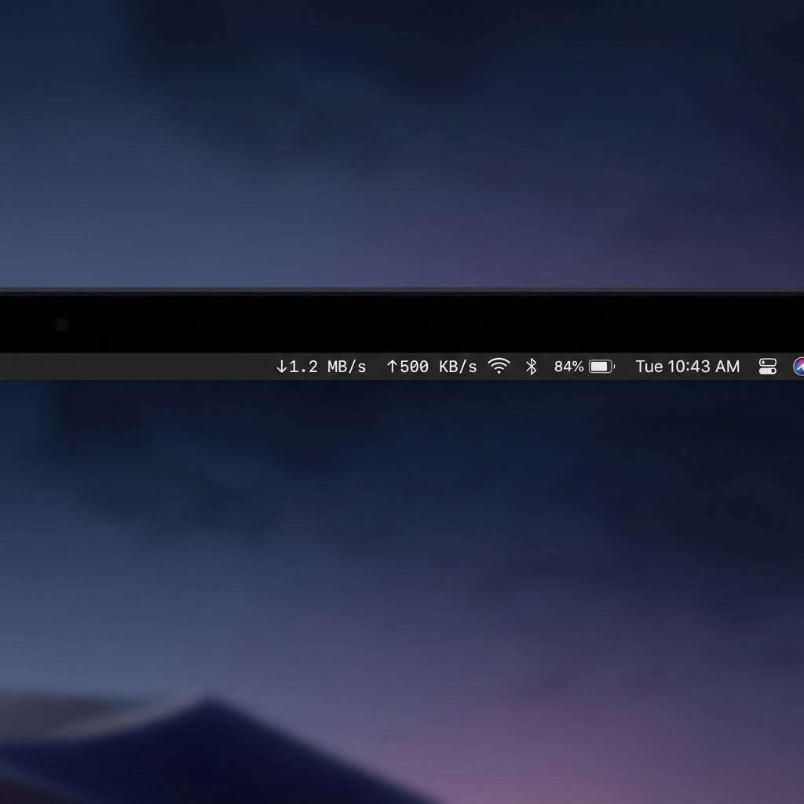
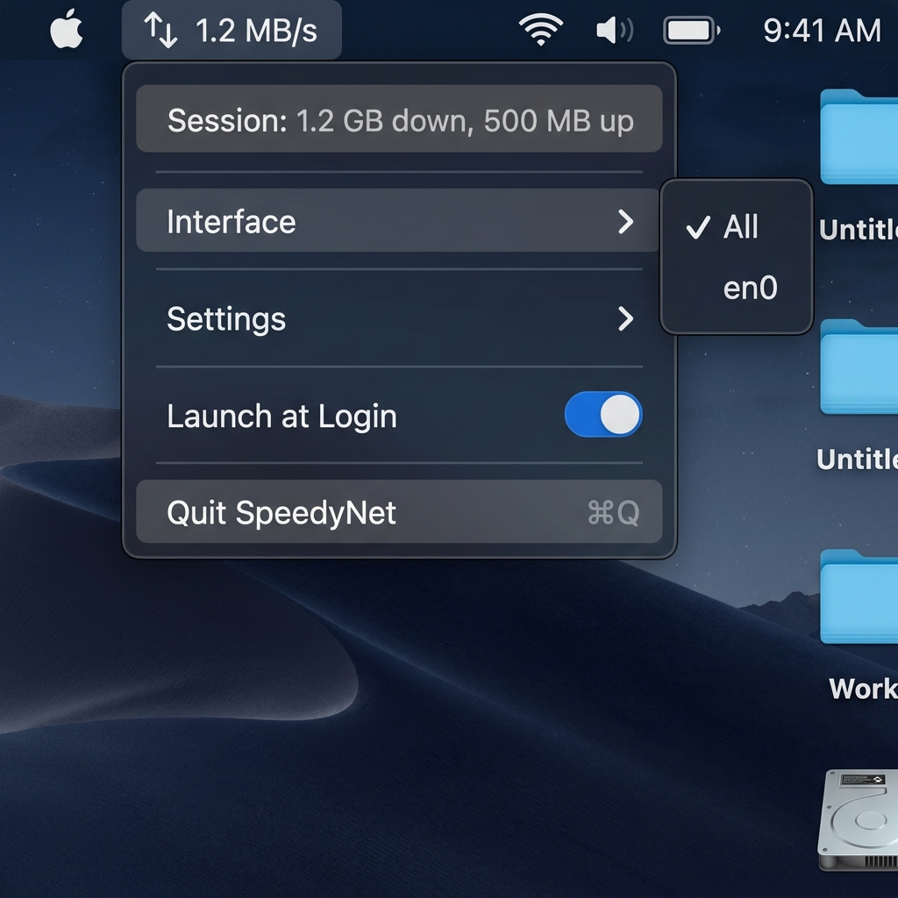

# macOS Network Monitor

A sleek, native macOS menu bar accessory that displays real-time network upload and download speeds, built entirely with Swift and standard macOS libraries (no third-party dependencies).



## Features

- **Real-time Speeds**: View download (↓) and upload (↑) speeds calculated dynamically from macOS `sysctl` kernel APIs.
- **Latency Monitor**: Probe a configurable HTTPS host (Cloudflare DNS by default) and track latency, jitter, and loss.
- **DNS Latency**: Resolve a hostname periodically as a second quality signal.
- **Connection Quality**: Good / Fair / Poor badge in the menu bar and popover from recent latency samples.
- **Wi‑Fi Details**: RSSI and TX rate in the popover (SSID when Location access allows it).
- **VPN/Tunnel Awareness**: Detect utun/ipsec/ppp/wg interfaces; optional VPN-only monitoring.
- **Speed Test**: Run on-demand download + upload tests (Cloudflare) with recent history in the popover.
- **Live Graph**: Left-click for a SwiftUI chart with 1/5/15/60 minute ranges and pause/resume (⌃⌥N hotkey).
- **Interface Breakdown**: Rank interfaces by current throughput (best-effort top talkers inside the sandbox).
- **Data Limits**: Daily and billing-cycle caps with 80% warnings; export usage CSV.
- **IPv4 + IPv6**: Show public addresses; refresh on demand.
- **SF Symbols**: Uses native Apple symbols for a clean and beautiful look in both light and dark mode.
- **Dynamic Colors**: Numbers change color (Green/Orange) when data thresholds are exceeded.
- **Interface Selection**: Choose to monitor all traffic, or isolate specific interfaces like Wi-Fi (`en0`) or loopback (`lo0`).
- **Session Totals**: See how much data has been downloaded and uploaded since the monitor was launched.
- **Customizable Intervals**: Dynamically update refresh rate from 0.5 to 5 seconds.
- **Bits vs Bytes**: Toggle between bits per second (Mbps) and bytes per second (MB/s).
- **Compact & Hide Modes**: Save menu bar space with `Compact Mode`, or automatically hide the monitor entirely when network traffic is inactive.
- **Launch at Login**: Integrates natively with `SMAppService` to safely auto-start on boot.



## Installation & Running

This project is a Swift Package. You must be on macOS 13+.

1. Clone the repository.
2. Build the project using the build script, which compiles the package and securely codesigns it:
   ```bash
   ./build.sh
   ```
3. Wait for the build to complete. The script creates the standard app bundle with Hardened Runtime and App Sandbox enabled.
4. Drag **`NetworkMon.app`** into your Mac's **Applications** folder.
5. Double-click it to launch! Since it is a menu bar accessory, it will silently appear in the top right of your screen. 
   *(Tip: Use the dropdown menu to toggle 'Launch at Login' so it starts automatically!)*

## Development

```bash
# Needs full Xcode (not Command Line Tools only) for XCTest:
DEVELOPER_DIR=/Applications/Xcode.app/Contents/Developer swift test
./build.sh
```

Settings: right-click menu → **Settings…** (or ⌘,) for quality thresholds, DNS host, tray layout, chart persistence, and Accessibility for the global hotkey.

Notarization (Developer ID): see [`docs/NOTARIZATION.md`](docs/NOTARIZATION.md) and `./notarize.sh`.

Per-app top talkers: see [`docs/TOP_TALKERS.md`](docs/TOP_TALKERS.md).

## Releases

### v1.5.0
- App icon, SwiftUI Settings window, tunable quality thresholds (+ optional DNS weight).
- Persist chart history across launches; Accessibility guidance for ⌃⌥N.
- Extract `SettingsStore`, `SpeedTester`, `ChartHistoryStore`; notarization scripts/docs.

### v1.4.0
- VPN/tunnel detection, chart ranges, speed-test history, billing-cycle caps.
- Per-interface rates, DNS latency, threshold alerts, CSV export, public IPv6.
- Reset counters, tray presets, ⌃⌥N hotkey, Location for SSID, String Catalog scaffolding.

### v1.3.0
- Connection quality badge (latency + jitter + loss).
- Configurable latency host (presets + custom).
- Wi‑Fi RSSI / TX rate in the popover and menu.

### v1.2.0
- Left-click opens a live download/upload history chart popover; right-click opens the menu.
- Speed test now measures download (20MB) and upload (10MB) via Cloudflare.

### v1.1.0
- Prefer IPv4 for local IP, refresh IPs on demand and every 15 minutes.
- Fix usage totals while “Hide when Inactive” is on; safer UInt64 preference storage.
- Speed test: prevent double-runs, request notification permission, report failures.
- Cancel overlapping latency probes; keep menu open without full rebuild flicker.
- Extract format helpers and add unit tests.

### v1.0.0
- Initial release featuring core network tracking, dynamic colors, interval toggling, interface isolation, and native backgrounding.
